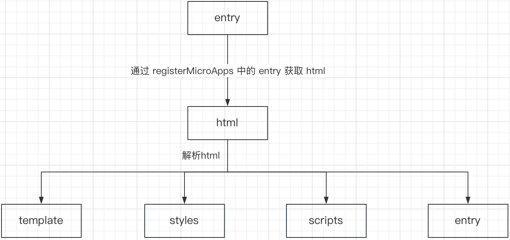
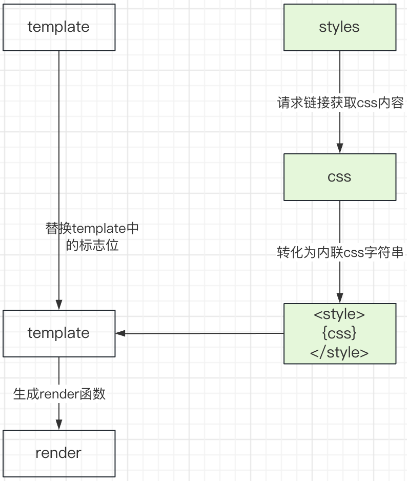
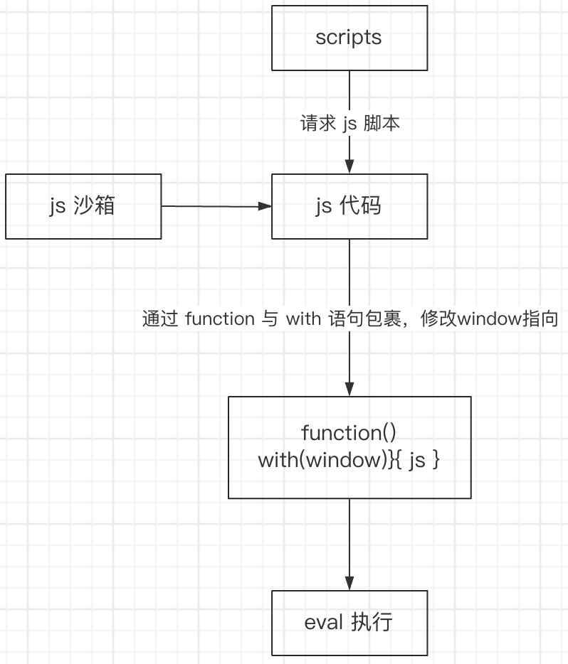
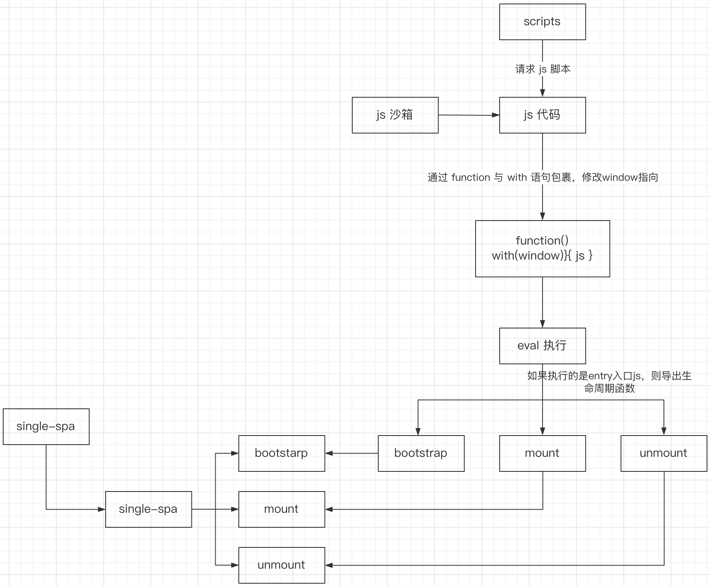
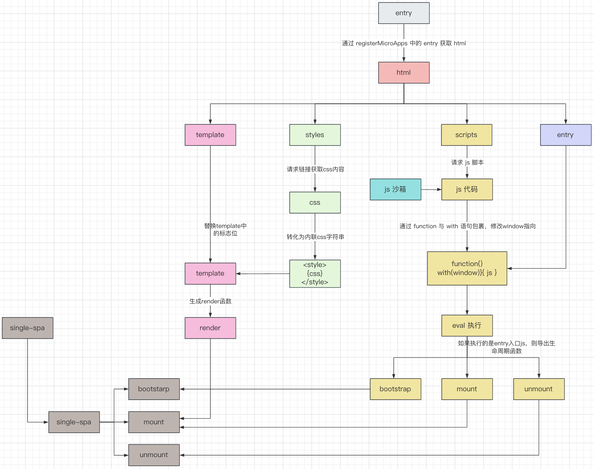

# qiankun（乾坤）源码阅读

## 基础认知

### 基本使用

在主应用中注册子应用

```
import { registerMicroApps, start } from 'qiankun';

registerMicroApps([
  {
    name: 'react app', // app name registered
    entry: '//localhost:7100',
    container: '#yourContainer',
    activeRule: '/yourActiveRule',
  },
  {
    name: 'vue app',
    entry: { scripts: ['//localhost:7100/main.js'] },
    container: '#yourContainer2',
    activeRule: '/yourActiveRule2',
  },
]);

start();
```

在子应用中，不需要引入任何依赖即可接入 `qiankun` 主应用，但是子应用需要在自己的入口 js (通常就是你配置的 webpack 的 entry js) 导出 `bootstrap`、`mount`、`unmount` 三个生命周期钩子，以供主应用在适当的时机调用

```js
/**
 * bootstrap 只会在微应用初始化的时候调用一次，下次微应用重新进入时会直接调用 mount 钩子，不会再重复触发 bootstrap。
 * 通常我们可以在这里做一些全局变量的初始化，比如不会在 unmount 阶段被销毁的应用级别的缓存等。
 */
export async function bootstrap() {
  console.log('react app bootstraped');
}

/**
 * 应用每次进入都会调用 mount 方法，通常我们在这里触发应用的渲染方法
 */
export async function mount(props) {
  ReactDOM.render(<App />, props.container ? props.container.querySelector('#root') : document.getElementById('root'));
}

/**
 * 应用每次 切出/卸载 会调用的方法，通常在这里我们会卸载微应用的应用实例
 */
export async function unmount(props) {
  ReactDOM.unmountComponentAtNode(
    props.container ? props.container.querySelector('#root') : document.getElementById('root'),
  );
}

/**
 * 可选生命周期钩子，仅使用 loadMicroApp 方式加载微应用时生效
 */
export async function update(props) {
  console.log('update props', props);
}
```

### qiankun 与 single-spa 关系

`qiankun`是基于 `single-spa` 实现的，而 `single-spa` 规定入口 js 文件必须通过 export 形式导出三个函数：`bootstrap`、`mount`、`unmount`，这也就不难理解为什么 `qiankun` 也需要导出这三个函数了

同时，`qiankun` 对 `single-spa` 做了包装，降低了上手成本，并且优化了 `singe-spa` 只能加载 js 的缺点，可以加载 html 文件，这更加符合开发。因为目前大多数前端项目都是基于 webpack 打包成的单页面应用，入口都是 html 文件

当然，`qiankun` 做的不仅仅是这些，下面，就看看，`qiankun` 基于 `single-spa` 做了哪些优化

## 源码解读

### qiankun 流程解读

首先，在使用的时候，会通过 `registerMicroApps` 注册微应用，如下：

```js
registerMicroApps([
  {
    name: 'react app', // app name registered
    entry: '//localhost:7100',
    container: '#yourContainer',
    activeRule: '/yourActiveRule',
  },
  {
    name: 'vue app',
    entry: { scripts: ['//localhost:7100/main.js'] },
    container: '#yourContainer2',
    activeRule: '/yourActiveRule2',
  },
]);
```

来看看在 `qiankun` 中，是怎么定义 `registerMicroApps` 方法的：

```js
import { registerApplication } from 'single-spa';

export function registerMicroApps<T extends ObjectType>(
  apps: Array<RegistrableApp<T>>,
  lifeCycles?: FrameworkLifeCycles<T>,
) {
  // Each app only needs to be registered once
  const unregisteredApps = apps.filter((app) => !microApps.some((registeredApp) => registeredApp.name === app.name));

  microApps = [...microApps, ...unregisteredApps];

  unregisteredApps.forEach((app) => {
    const { name, activeRule, loader = noop, props, ...appConfig } = app;

    registerApplication({
      name,
      app: async () => {
        loader(true);
        await frameworkStartedDefer.promise;

        const { mount, ...otherMicroAppConfigs } = (
          await loadApp({ name, props, ...appConfig }, frameworkConfiguration, lifeCycles)
        )();

        return {
          mount: [async () => loader(true), ...toArray(mount), async () => loader(false)],
          ...otherMicroAppConfigs,
        };
      },
      activeWhen: activeRule,
      customProps: props,
    });
  });
}
```

可以看出，`registerMicroApps` 主要调用了 `single-spa` 的 `registerApplication`，基础流程可以拆解为：

1. 加载 html 资源，获取页面、样式、js 脚本三种资源数据
2. 对外部样式资源（css）进行加载处理，生成 `render` 函数
3. 生成 `js` 沙箱
4. 加载外部 js 脚本，并进行包装，执行
5. 从入口文件里获取生命周期钩子函数：`bootstrap`、`mount`、`unmount`，然后当作`single-app` 的 `registerApplication` 的 `app` 形参中的返回数据

#### 加载解析 html 资源

在 `qiankun` 中，会调用 `import-html-entry` 这个第三方库去加载和解析 html 资源（通过正则表达式解析并提取其中的`link`元素和`script`元素）

```js
import { importEntry } from 'import-html-entry';

const { template, execScripts, assetPublicPath, getExternalScripts } = await importEntry(entry, importEntryOpts);
```

举例子，假设子应用的 html 代码如下：

```js
<!DOCTYPE html>
<html lang="en">
  <head>
    <meta charset="utf-8" />
    <link rel="icon" href="/favicon.ico" />
    <title>React App</title>
    <link href="/react-app/static/css/main.css" rel="stylesheet" />
    <style type="text/css">
      .contaier {
        width: auto;
      }
    </style>
  </head>
  <body>
    <div id="root"></div>
    <script>
      function(){}
    </script>
    <script defer="defer" src="/react-app/static/js/chunk1.js"></script>
    <script defer="defer" src="/react-app/static/js/main.js"></script>
  </body>
</html>
```

经过 `import-html-entry` 解析后，返回 `template(html页面)`、`scripts(script外链或脚本列表)`、`entry(js入口资源链接)`、`styles(样式外链资源列表)`，分别如下：

```js
// 对 内联脚本 和 资源类型为javascript 的script取替成<!--  xxx replaced by import-html-entry -->标志位
// 对资源类型为stylesheet的link取替成<!--  xxx replaced by import-html-entry -->标志位
template = `
  <html lang="en">
  <head>
    <meta charset="utf-8" />
    <link rel="icon" href="/favicon.ico" />
    <title>React App</title>
    <!--  link http://xxx/react-app/static/css/main.css replaced by import-html-entry -->
    <style type="text/css">
      .contaier {
        width: auto;
      }
    </style>
  </head>
  <body>
    <div id="root"></div>
    <!-- inline scripts replaced by import-html-entry -->
    <!--  script http://xxx/react-app/static/js/chunk1.js replaced by import-html-entry -->
    <!--  script http://xxx/react-app/static/js/main.js replaced by import-html-entry -->
  </body>
</html>
`;

// 集成所有 内联脚本 和 资源类型为javascript的script外链
scripts = [
  '\x3Cscript>\n      function(){}\n    \x3C/script>',
  'http://xxx/react-app/static/js/chunk1.js',
  'http://xxx/react-app/static/js/main.js',
];

// 如果存在带entry的script元素，则entry为script元素的外链或内联脚本。否则为scripts最后的元素
entry = 'http://xxxx/react-app/static/js/main.js';

// 集成所有 资源类型为stylesheet的link外链
styles = ['http://xxx/react-app/static/css/main.css'];
```

其中，在 `template` 中，会对内联脚本、资源类型为 javascript 的 script、资源类型为 stylesheet 的 link 做标志位处理，后续会分别对资源进行处理，再替换

加载解析 html 的流程图如下：



#### 加载处理外部样式资源（css），生成`render`函数

对于上一步获取到的 styles 列表，进行 fetch 请求，获取到 css 代码，生成内联样式 `<style>xxxx</style>` 插入且替换步骤一中`template`对应的标志位上

比如有如下 css 资源链接 `"http://xxx/react-app/static/css/main.css"`, 对应样式资源的`css`代码如下所示:

```js
.toolbar {
  width: 100%;
}
```

那么插入到 `template` 后，如下：

```js
<!DOCTYPE html>
<html lang="en">
  <head>
    <meta charset="utf-8" />
    <link rel="icon" href="/favicon.ico" />
    <title>React App</title>
    <style>
      /* http://xxx/react-app/static/css/main.css */
      .toolbar {
        width: 100%;
      }
    </style>
    <style type="text/css">
      .contaier {
        width: auto;
      }
    </style>
  </head>
  <body>
    <div id="root"></div>
    <!-- inline scripts replaced by import-html-entry -->
    <!--  script http://xxx/react-app/static/js/main.js replaced by import-html-entry -->
  </body>
</html>
```

完成这一步后会生成`render`函数，`render`函数用于把上述的`template`插入到应用基座上。`render`函数会在`single-spa`里的`mount`生命周期中执行，即放入到 `single-app` 的`registerApplication`的`app`参数的返回的`mount`属性里。

这一步的流程图如下：

 

#### 生成 js 沙箱

详细的 `qiankun沙箱` 可以参考：

- https://juejin.cn/post/7070032850237521956
- https://juejin.cn/post/7148075486403362846

`qiankun`会根据用户设置的`sandbox`属性来生成 **`js`沙箱**，**`js`沙箱** 用于隔离应用间的`window`环境，防止子应用在执行代码期间影响了其他应用设置在`window`上的属性。`qiankun`内置的沙箱有三种：`ProxySandbox`、`LegacySandbox`、`SnapshotSandbox`

下面分别看下三种沙箱：

**SanpshotSandbox**

这一种，就是【快照沙箱】，主要原理：把主应用的 `window` 对象做浅拷贝，将 `window` 的键值对存成一个 `Hash Map`。之后无论微应用对 `window` 做任何改动，当要在恢复环境时，把这个 `Hash Map` 又应用到 `window` 上就可以了。

这种沙箱明显的缺点就是：这个沙箱有个缺点，就是需要遍历 window 上的所有属性，性能较差

**LegacySandbox**

随着 ES6 的普及，利用 Proxy 可以比较良好的解决 SanpshotSandbox 需要遍历的问题，这就诞生了 LegacySandbox。

**ProxySandbox**

前面两种沙箱都是 **单例模式** 下使用的沙箱。**也即一个页面中只能同时展示一个微应用，而且无论是 `set` 还是 `get` 依然是直接操作 `window` 对象。**

在这样单例模式下，微应用修改全局变量时，依然会在原来 window 上修改，因此，如果同一个路由下展示多个微应用，仍然会有环境变量污染的问题

为了避免这种情况下真实的 `window` 被污染，qiankun 实现了 `ProxySandbox`。具体做法是：

- 把原生 window 的一些属性，例如 document、location 等，拷贝出来，单独放在一个对象上，这个对象也被称为 fakeWindow
- 然后，为每个微应用分配一个 fakeWindow
- 当微应用修改全局属性时：
  - 如果是原生属性，则修改全局的 `window`
  - 如果不是原生属性，则修改 fakeWindow
- 微应用获取全局属性时：
  - 如果是原生属性，则从 window 上拿
  - 如果不是原生属性，则优先从 fakeWindow 上拿

这样一来连恢复环境都不需要了，因为每个微应用都有自己一个环境，当在 `激活` 时就给这个微应用分配一个 `fakeWindow`，当 `失活` 时就把这个 `fakeWindow` 存起来，以便之后再利用。

#### 加载外部脚本资源（js），并进行包装、执行

这一步，对外部 js 脚本进行请求，获取到 js 代码。例如，上面解析 html 得到的某个 js 资源是：http://xxx/react-app/static/js/chunk1.js，并且里面的代码是：

```js
function fn() {
  var obj = {};
  obj.name = 'jack';
  return obj;
}

fn();
```

在这里解析 js 代码，并且进行包装以修改其作用域上的`window`，得到如下：

```js
;(function(window, self, globalThis){
  with(window){
    function fn() {
      var obj = {}
      obj.name = 'jack'
      return obj
    }
    fn()
  }
  //# sourceURL=http://xxx/react-app/static/js/chunk1.js
).bind(window.proxy)(window.proxy, window.proxy, window.proxy)
```

`window.proxy` 是在上一步生成的 js 沙箱，通过 bind 传入到匿名函数的作用域，然后再通过 `with` 语句，将 `window`从全局 `Window` 对象切换到该 js 沙箱。从而使子应用在运行过程中调用的 `window` 实际上是一个目标为 `fakeWindow` 的 `Proxy` 实例，从而完成了应用间`window`的隔离。

最后，经过上面包装的代码，会通过 `eval` 语句执行

这一步的基本流程图：

 

#### 从入口文件里获取生命周期钩子函数：`bootstrap`、`mount`、`unmount`，然后交给`single-spa`去调用执行

在使用教程中，子应用需要配置一下打包工具，如下：

```js
const packageName = require('./package.json').name;

module.exports = {
  output: {
    library: `${packageName}-[name]`,
    libraryTarget: 'umd',
    jsonpFunction: `webpackJsonp_${packageName}`,
  },
};
```

简单了解下`library`，它用于在执行环境中插入一个全局对象，该全局对象会包含入口文件中通过`export`导出的所有方法。例如如果在名为 `react-ts-app` 子应用里打印 `window["react-ts-app-main"]`

> 注意这个插入过程是对子应用的`window`进行的，也就是`js`沙箱中的`proxy`，因此如果在控制台里直接打印`window["react-ts-app-main"]`是不会输出以上结果的。

因此在入口文件在上一步骤中包装且`eval`执行后，`qiankun`会通过等同于`Object.keys(window).pop()`获取到最新插入的属性`"react-ts-app-main"`，然后通过`window["react-ts-app-main"]`拿到这些生命周期钩子函数。最终这些生命周期钩子函数用作`single-spa`的`registerApplication`的`app`的返回数据里。从而完成了从解析`html`到把入口文件中的生命周期钩子函数交给`single-spa`调用的整个过程。

这一步的流程图：



#### 整个加载流程

基于上面五步，串联整个加载流程图如下：


