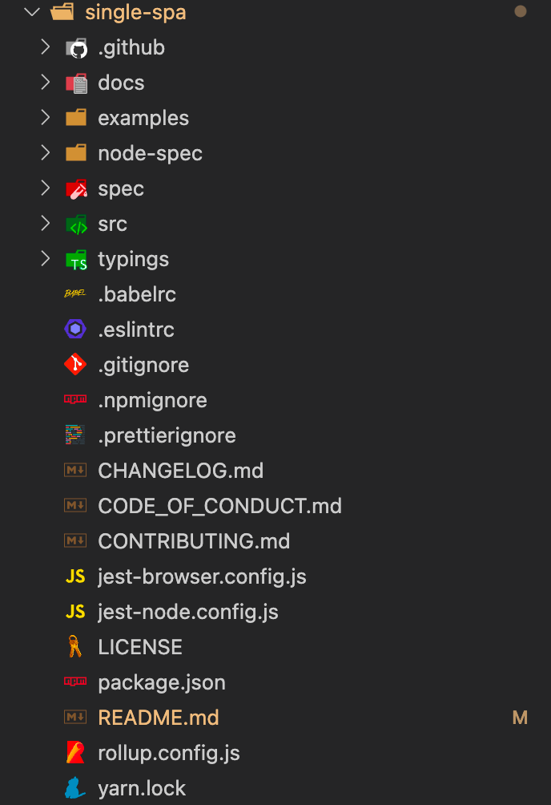

# single-spa 源码阅读

本文基于 single-spa 5.9.3 版本

目录结构为：

 

简单从 single-spa 的目录源码结构就能看出来，整个项目是基于 rollup 打包的，进入到 `rollup.config.js` 文件里面，会发现，项目入口是 `src` 下的 `single-spa.js`

```js
export default (async () => [
  {
    input: "./src/single-spa.js",
    output: [
      // .....
    ],
  },
  {
    input: "./src/single-spa.js",
    output: {
      // .....
    },
  },
])();
```


## 入口文件

上面提到，`single-spa.js` 是入口，下面来看看这个入口文件中有什么东西

```js
export { start } from "./start.js";
export { ensureJQuerySupport } from "./jquery-support.js";
export {
  setBootstrapMaxTime,
  setMountMaxTime,
  setUnmountMaxTime,
  setUnloadMaxTime,
} from "./applications/timeouts.js";
export {
  registerApplication,
  unregisterApplication,
  getMountedApps,
  getAppStatus,
  unloadApplication,
  checkActivityFunctions,
  getAppNames,
  pathToActiveWhen,
} from "./applications/apps.js";
export { navigateToUrl } from "./navigation/navigation-events.js";
export { triggerAppChange } from "./navigation/reroute.js";
export {
  addErrorHandler,
  removeErrorHandler,
} from "./applications/app-errors.js";
export { mountRootParcel } from "./parcels/mount-parcel.js";

export {
  NOT_LOADED,
  LOADING_SOURCE_CODE,
  NOT_BOOTSTRAPPED,
  BOOTSTRAPPING,
  NOT_MOUNTED,
  MOUNTING,
  UPDATING,
  LOAD_ERROR,
  MOUNTED,
  UNMOUNTING,
  SKIP_BECAUSE_BROKEN,
} from "./applications/app.helpers.js";

import devtools from "./devtools/devtools";
import { isInBrowser } from "./utils/runtime-environment.js";

if (isInBrowser && window.__SINGLE_SPA_DEVTOOLS__) {
  window.__SINGLE_SPA_DEVTOOLS__.exposedMethods = devtools;
}
```

发现，其实入口文件，就是导出了一堆 single-spa 的 API，提供给外部使用。


## single-spa 基本使用

single-spa 最基本的使用方法是：

- 主应用入口调用 registerApplication 注册子应用；调用 start 方法启动
- 子应用入口导出 bootstrap、mount、unmount 等生命周期函数


## 注册应用 registerApplication

